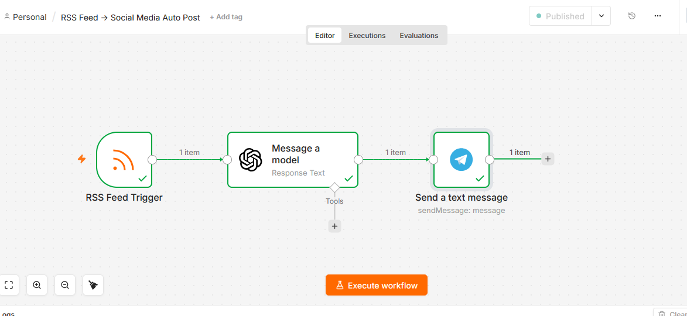

# 📰 RSS Feed → Social Media Auto Post — n8n + OpenAI Automation

## What This Does

I built this because content creators were wasting hours every day.

They would find an interesting article.
Copy the link.
Write a post.
Add emojis.
Add hashtags.
Post it manually.

Every single day. Multiple times a day.

So I automated the whole thing.

Now when a new article appears on any news website,
three things happen instantly — without you touching anything:

- AI reads the article and writes an engaging human-like post
- The post goes to your Telegram channel automatically
- Your audience gets fresh content every single hour

You sleep. The channel grows.
You work. The channel grows.
You are on vacation. The channel grows.

Zero manual work. Ever.

---

## The Problem I Solved

I talked to content creators, bloggers and business owners.

They all said the same thing.

"I spend 2 hours every day just writing social media posts."
"My channel goes silent when I am busy."
"I miss trending news because I cannot watch it 24/7."

One creator told me she lost 500 followers in a month
just because she stopped posting consistently.

Consistency is everything on social media.
But nobody can post manually every single hour.

This workflow fixes that forever.
Fresh content. Every hour. Automatically.

---

## How It Works

No coding. No complicated setup.
Just a clean intelligent system that works every time.

Step 1 — RSS Feed checks for new articles every hour
BBC Technology. TechCrunch. Any news site you choose.
The moment a new article appears, n8n wakes up.

Step 2 — OpenAI reads the article
Title. Summary. Key points.
The AI understands exactly what the story is about.

Step 3 — AI writes a human-like post
Not robotic. Not templated.
A real engaging post that sounds like a person wrote it.
With genuine reaction. With emojis. With a question at the end.

Step 4 — Post goes to your Telegram channel automatically
Your audience sees fresh relevant content.
They engage. They share. Your channel grows.

The whole process takes less than 10 seconds.
Every single hour. Every single day. Forever.

---

## Workflow Screenshot



---

## Flow Diagram

```
RSS Feed New Article
        ↓
n8n Wakes Up
        ↓
OpenAI Reads Article
        ↓
AI Writes Human-Like Post
        ↓
Post to Telegram Channel
        ↓
Done ✅
```

---

## The Nodes I Used

### Node 1 — RSS Feed Trigger
Checks your chosen RSS feed every hour automatically.
The moment a new article appears,
this node wakes up and passes the content forward.
Works 24 hours a day. Never misses a story.

RSS URL I used for demo:
https://feeds.bbci.co.uk/news/technology/rss.xml

Any news website RSS URL works exactly the same way.

### Node 2 — OpenAI (Message a Model)
The brain of the whole system.
Reads the article title and summary.
Writes a genuine engaging social media post.
Sounds like a real person. Not a robot.
Model used: GPT-4o-mini — fast, smart, costs almost nothing.

### Node 3 — Telegram (Send Message)
Takes the AI written post and sends it to your channel.
Your audience sees it instantly.
Clean. Professional. Engaging. Every time.

---

## AI Writing Style

I trained the AI to write like a real human being.

Not like this:
"New article published. Click to read more. #Tech #News"

Like this:
"Just read something that genuinely surprised me today.
Apparently the new chip from this company is 3x faster
than anything we have seen before. And the price?
Actually affordable for once. What do you think —
is this the moment everything changes? 🔥 #Tech #AI #Future"

The difference is everything.
One gets ignored. One gets shared.

---

## Who Needs This

- Telegram channel owners who want consistent daily content
- Bloggers who want to repurpose news into social posts
- Marketing agencies managing multiple client channels
- Business owners who want thought leadership content
- Anyone who wants a growing audience without daily effort

---

## Real Questions From Real Buyers

**Can I use any news website or just BBC?**
Any website with an RSS feed works perfectly.
Tech news. Business news. Sports. Health. Anything.

**Can I post to multiple channels?**
Yes. Add more Telegram nodes for each channel.
One workflow. Multiple channels. Same effort.

**Will the posts sound like AI wrote them?**
No. I specifically trained the AI to write like a real person.
Casual tone. Genuine reactions. Natural sentences.
Your audience will never know.

**How often does it post?**
Every hour by default.
You can change it to every 30 minutes or every 3 hours.
Whatever suits your audience.

**What does it cost to run?**
Almost nothing.
OpenAI GPT-4o-mini costs about $0.001 per post.
$5 credit lasts approximately 6 to 7 months of hourly posting.

**Can I review posts before they go live?**
Yes. I can add an approval step where you confirm each post first.

**Do I need coding knowledge?**
Zero. Completely no code required.

**Is this a one time setup?**
Yes. Set it up once. It runs forever.

---

## Download & Import Workflow

You can import this workflow directly into your n8n.

1. Download the file here: Go Json Folder
2. Open n8n
3. Click Import Workflow
4. Upload the JSON file
5. Add your OpenAI API key
6. Add your Telegram Bot token
7. Set your RSS feed URL
8. Publish and your channel runs itself

---

## What I Built This With

- n8n — workflow automation (free at n8n.io)
- RSS Feed Trigger — monitors any news website
- OpenAI API — GPT-4o-mini for human-like writing
- Telegram Bot API — posts to your channel automatically

Running cost: approximately $0.001 per post.
$5 OpenAI credit lasts 6 to 7 months.

---

## 💰 Hire Me — Pricing

I do not just send you a JSON file.
I set up the entire system for your specific niche.
Your RSS sources. Your writing style. Your channel.
Tested. Live. Growing.

| Package | Price | What You Get |
|---------|-------|-------------|
| **Basic** | $30 | Full workflow setup + 1 RSS source + Telegram channel + tested + live |
| **Standard** | $50 | Everything in Basic + 3 RSS sources + custom AI writing style + 3 days support |
| **Premium** | $80 | Everything in Standard + 5 RSS sources + multiple channels + approval system + 7 days support |

---

## Why Work With Me

I show my full work right here on GitHub.
Every node. Every step. Every decision.
I even show the mistakes I made and exactly how I fixed them.

The AI I set up does not write like a robot.
I specifically trained it to sound like a real passionate human.
That is the difference between a channel that grows
and a channel that gets ignored.

No surprises. No hidden steps. No confusion.
Just a working automated content machine delivered professionally.

---

## Ready To Get Started?

Message me on Fiverr or Upwork.
Tell me your niche and your target audience.
I will build you a content machine that never stops working.

Response time: under 2 hours.

I look forward to working with you.
